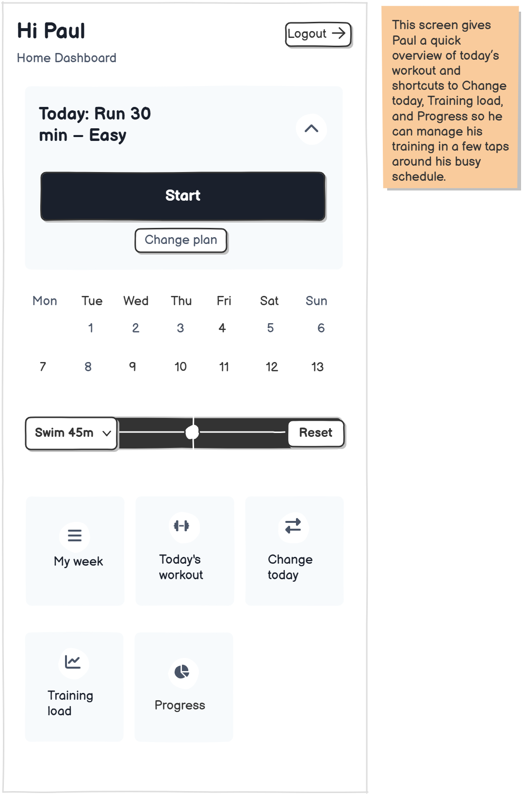

# FitApp - UX/UI Case Study & Prototype

**Authors:** Mintesnot Yimer, Pamit Duggal, Moeez Ahmed  
**Context:** M2 MIAGE - Innovative Information Systems (Université Toulouse 1 Capitole)  
**Tools:** Balsamiq, Paper Prototyping, SUS Analysis

## 1. Executive Summary
FitApp is a user-centered mobile application designed for amateur triathletes balancing training with demanding work/family schedules. 
* **Problem:** Existing apps (Strava, Garmin) lack features for planning around family constraints or managing injury risks for casual users.
* **Solution:** An adaptive training planner with "Safety-First" logic and family-aware scheduling.
* **Result:** The final prototype achieved a **System Usability Scale (SUS) score of 76.25** ("Good" to "Excellent") during user testing.

## 2. Design Process
We followed a 4-step iterative design process:

### Step 1: User Research & Persona
We designed for **"Paul"**, a busy father recovering from a leg injury.
* **Core Needs:** Time management (family/work), Injury prevention, Flexibility.
* **Key Innovation:** Unlike competitors, FitApp integrates "free time slots" from a user's calendar to suggest realistic workouts.

### Step 2: Prototyping (Low to Mid-Fidelity)
* **Paper Prototypes:** Rapidly sketched 8 core screens to test navigation flows.
* **Balsamiq Wireframes:** Created 10 interactive screens to simulate user journeys, focusing on layout and flow over visual polish.

### Step 3: Usability Testing & Evaluation
We conducted rigorous testing using three methods:
1.  **Task-Centered Walkthrough:** Verified specific scenarios like "Rescheduling a run due to a sick child".
2.  **Heuristic Evaluation:** Identify violations of Nielsen’s usability heuristics (e.g., adding "Toast" confirmations to improve *Visibility of System Status*).
3.  **SUS Testing:** Achieved a mean score of **76.25/100**.

### Step 4: Iteration & Redesign
Based on testing data, we improved the prototype:
* **Training Load:** Redesigned specific warnings (e.g., "Load High - Rest Tomorrow") to be more actionable for injury prevention.
* **Feedback Loops:** Added "Toast" notifications to confirm schedule changes.
* **Clarity:** Added icons to the "Change Today" options to reduce cognitive load.

## 3. Key Views

<table>
  <tr>
    <td align="center"><b>Home Dashboard</b></td>
    <td align="center"><b>Training Load</b></td>
    <td align="center"><b>Change Today</b></td>
  </tr>
  <tr>
    <td></td>
    <td></td>
    <td></td>
  </tr>
</table>

## 4. Full Report
* [📄 Read the Full UI/UX Report (PDF)](https://github.com/MintesnotYIMER/FitApp-UX-Prototype./blob/main/File/Mintesnot_Pamit_Moeez_UI-UX%20report.pdf)
* [📄 See the Whole WireFrames (PDF)](https://github.com/MintesnotYIMER/FitApp-UX-Prototype./blob/main/File/Group4_DUGGAL-YIMER-AHMED.pdf)
